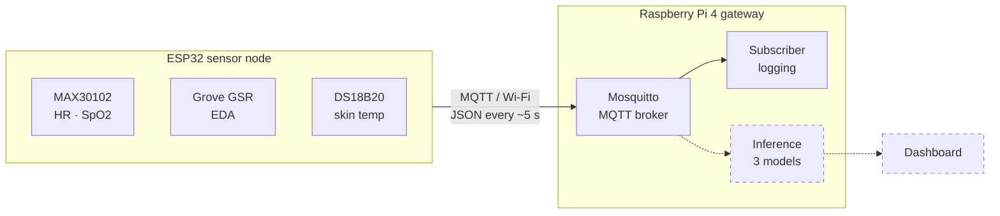

# Real-Time Student Stress Detection — ESP32 · Raspberry Pi · ML

End-to-end system for real-time physiological stress detection: a wearable
ESP32 sensor node streams data over MQTT to a Raspberry Pi 4 gateway, where
machine-learning models trained on the WESAD dataset classify each 5-second
window as *baseline* or *stress*.

Part of a doctoral research project at the Faculty of Electronic Engineering,
University of Niš. System architecture published at ICEST 2026 (see
[Publication](#publication)).

> **Status:** work in progress. Firmware, MQTT transport and the ML training
> pipeline work end-to-end; real-time inference on the Pi is the next step.
> See [Roadmap](#roadmap).

## Architecture



Dashed components are planned. All data stays local (no cloud), in line with
the privacy-by-design goal of the project.

## Repository structure

```
├── firmware/      ESP32 node (PlatformIO, Arduino framework)
├── gateway/       Raspberry Pi MQTT subscriber
├── ml/            Feature extraction, per-subject normalization, experiments
│   ├── data/      Datasets (not in git)
│   └── results/   Experiment results (CSV)
├── requirements.txt   Pinned Python environment, identical on PC and Pi
└── Max30102.code-workspace   VS Code workspace (root + PlatformIO project)
```

## Firmware (`firmware/`)

| Sensor | Signal | Interface |
|---|---|---|
| MAX30102 | PPG → heart rate, SpO2 | I²C (default pins) |
| Grove GSR | electrodermal activity, raw 12-bit ADC | GPIO35 (ADC1) |
| DS18B20 | skin temperature, 0.0625 °C resolution | 1-Wire, GPIO4 |

Every ~5 s the node publishes one JSON message. GSR is sampled every ~250 ms
during the PPG acquisition window without blocking, so each message carries a
short array of raw GSR samples. The node ID is derived from the eFuse MAC.

**MQTT topics**

| Topic | Content |
|---|---|
| `api/v1/esp32/<nodeId>/telemetry` | sensor data, payload format v2 |
| `api/v1/esp32/<nodeId>/status` | `online` / `offline` (retained, last will) |
| `api/v1/esp32/<nodeId>/calibration` | GSR baseline (retained) |

Example telemetry payload (format v2):

```json
{"fw":2,"seq":24,"node_ms":158576,
 "sensorData":{"HeartRate":-999,"heartRateValid":0,"SpO2":-999,"Spo2Valid":0,
               "GSR":[2295,2334,2338],"Temperature":25.81},
 "sensors_ok":{"max":1,"gsr":1,"temp":1}}
```

`seq` increases with every message, so the gateway can detect lost packets.
`-999` marks an invalid HR/SpO2 reading.

**Build:** open `Max30102.code-workspace` in VS Code with PlatformIO, then
create `firmware/include/Credentials.h` (not in git):

```cpp
#define SSID "your-2.4GHz-network"
#define PASS "password"
#define MQTTSERVER "x.x.x.x"   // Pi address
#define MQTTPORT 1883
#define IPADDRESS x,x,x,x     // static IP of the node
#define GATEWAY x,x,x,x
#define SUBNET x,x,x,x
```

## ML pipeline (`ml/`)

Models are trained on the wrist modality of WESAD (Empatica E4: BVP, EDA,
TEMP; baseline vs. stress, 15 subjects) with five features per 5-second
window: `mean_hr`, `eda_mean`, `eda_std`, `temp_mean`, `temp_slope`.
WESAD has no SpO2, so SpO2 is not used as a model feature.

**Per-subject normalization.** People differ strongly in their resting
physiology. Each feature is z-scored against the person's own calibration
period at the start of a session. `normalization.py` is the single
implementation used both in training and (planned) on the Pi, to avoid
training/serving skew.

**Setup and run** (Python 3.13):

```bash
pip install -r requirements.txt
# point to the raw WESAD dataset (default: ml/data/WESAD)
export WESAD_PATH=/path/to/WESAD        # PowerShell: $env:WESAD_PATH="..."
python ml/feature_extraction.py          # -> ml/data/wesad_features.csv
python ml/train_calibration_experiment.py  # -> ml/results/
```

### Results: calibration length (LOSO, 15 subjects)

Leave-one-subject-out cross-validation. For a fair comparison, the first
5 minutes of every test subject are excluded from evaluation in all
conditions. *raw* = no per-subject normalization.

| Model | F1 raw | F1 30 s | F1 2 min | F1 5 min |
|---|---|---|---|---|
| Logistic Regression | 0.735 | 0.766 | **0.886** | 0.867 |
| Random Forest | 0.841 | 0.856 | **0.924** | 0.878 |
| XGBoost | 0.731 | 0.857 | **0.911** | 0.900 |

Per-subject normalization improves all three models; a 2-minute calibration
gives the best F1. A 30-second calibration underestimates feature
variability (e.g. skin temperature barely changes in 30 s), which inflates
z-scores. Results are reproducible bit-for-bit in the pinned environment.

**Known limitation:** in WESAD the stress phase always follows the baseline,
so normalized features may partly encode elapsed time. The planned real-world
protocol (baseline → stress → recovery) is designed to test this.

## Gateway (`gateway/`)

Raspberry Pi 4 (64-bit OS, Python 3.13) running Mosquitto and a Python
subscriber that logs telemetry per node and per day to CSV.

```bash
python3 -m venv ~/stress-env && source ~/stress-env/bin/activate
pip install -r requirements.txt
python gateway/pi_subscriber.py
```

> The subscriber still parses the previous payload format; updating it to
> format v2 is on the roadmap.

## Engineering notes

**MQTT packet loss traced to the physical layer.** A one-hour soak test
showed ~14 % packet loss and ~22 disconnects, all logged by the broker as
keep-alive timeouts. Instrumenting the node (RSSI, connection state, heap)
ruled out the firmware and memory fragmentation: the node sat at
−92 dBm. At −76 dBm the same setup ran ~62 minutes with zero lost packets.
Takeaway: reliable deployment needs signal margin, e.g. a gateway access
point in the same room, not firmware workarounds.

## Roadmap

- [ ] Gateway: payload v2, gap detection from `seq`
- [ ] Sensor validity flags (signal valid, not just sensor connected)
- [ ] Align node features with model inputs (EDA direction, temperature slope, HR noise)
- [ ] Final models with per-subject normalization, real-time inference on the Pi
- [ ] Pilot study: baseline → stress → recovery
- [ ] Pi as dedicated access point for the sensor nodes

## Publication

B. Nikolić, A. Spasić, D. Janković, "Real-Time Multimodal Student Stress
Detection System Using IoT Wearables and Machine Learning: Model in Problem
Space," ICEST 2026.

## Dataset

P. Schmidt et al., "Introducing WESAD, a multimodal dataset for wearable
stress and affect detection," Proc. ICMI, 2018. The dataset is not
redistributed in this repository.